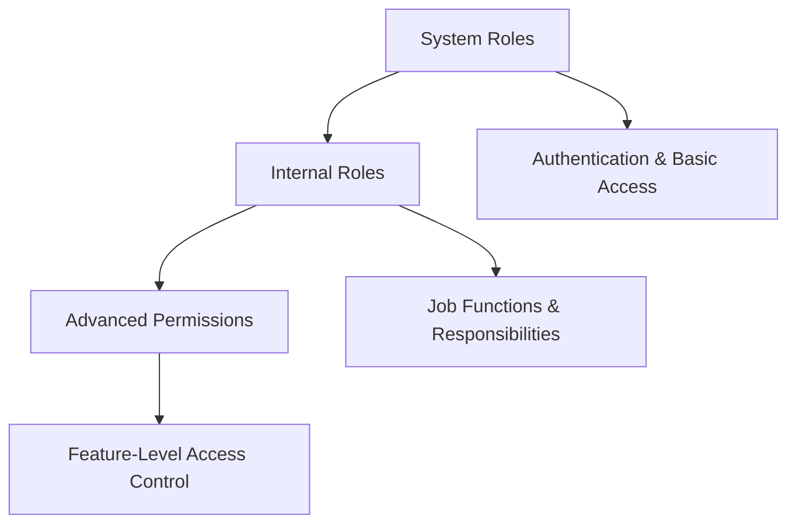
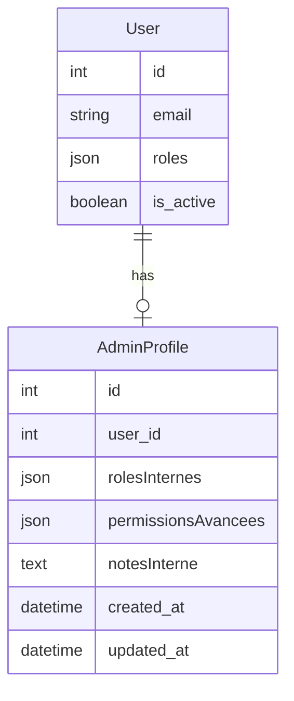
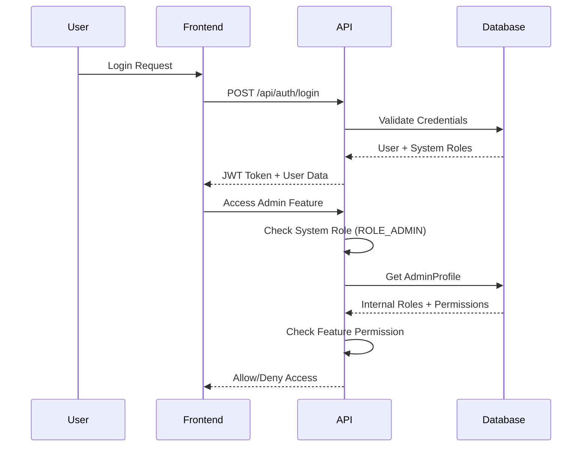

# JoodKitchen - Roles & Permissions System Documentation

## 📋 Table of Contents

1. [System Overview](#system-overview)
2. [Architecture Layers](#architecture-layers)
3. [System Roles](#system-roles)
4. [Internal Roles](#internal-roles)
5. [Advanced Permissions](#advanced-permissions)
6. [Database Structure](#database-structure)
7. [Implementation Examples](#implementation-examples)
8. [API Endpoints](#api-endpoints)
9. [Frontend Integration](#frontend-integration)
10. [Security Flow](#security-flow)
11. [Extending the System](#extending-the-system)
12. [Best Practices](#best-practices)

---

## System Overview

The JoodKitchen application implements a **3-layer hierarchical permission system** designed for flexibility, security, and scalability in restaurant management operations.

### Key Principles
- **Separation of Concerns**: Authentication, Authorization, and Feature Access are handled separately
- **Inheritance**: Higher roles automatically include lower role permissions
- **Granular Control**: Fine-grained permissions for specific features
- **Audit Trail**: All role assignments and changes are tracked

---

## Architecture Layers



### Layer 1: System Roles (Symfony Security)
- **Purpose**: Authentication and basic access control
- **Storage**: User entity `roles` field
- **Scope**: Application-wide security

### Layer 2: Internal Roles (Business Logic)
- **Purpose**: Job functions and organizational roles
- **Storage**: AdminProfile entity `rolesInternes` field
- **Scope**: Business context and responsibilities

### Layer 3: Advanced Permissions (Feature Access)
- **Purpose**: Granular feature and module access
- **Storage**: AdminProfile entity `permissionsAvancees` field
- **Scope**: Specific functionality within the application

---

## System Roles

Defined in `config/packages/security.yaml`:

```yaml
role_hierarchy:
    ROLE_CLIENT: ROLE_USER
    ROLE_KITCHEN: ROLE_USER
    ROLE_ADMIN: [ROLE_USER, ROLE_CLIENT, ROLE_KITCHEN]
    ROLE_SUPER_ADMIN: [ROLE_ADMIN]
```

### Role Definitions

| Role | Inheritance | Access Level | Description |
|------|-------------|--------------|-------------|
| `ROLE_USER` | Base | Public Areas | Basic authenticated user |
| `ROLE_CLIENT` | ROLE_USER | Customer Portal | Restaurant customers |
| `ROLE_KITCHEN` | ROLE_USER | Kitchen Interface | Kitchen staff and cooks |
| `ROLE_ADMIN` | All Above | Admin Panel | Restaurant administrators |
| `ROLE_SUPER_ADMIN` | All Roles | Full System | System administrators |

### Security Configuration

```yaml
access_control:
    # Public endpoints
    - { path: ^/api/auth, roles: PUBLIC_ACCESS }
    
    # Admin panel access
    - { path: ^/admin, roles: PUBLIC_ACCESS }  # Handled by frontend JS
    
    # API endpoints
    - { path: ^/api/users, roles: ROLE_ADMIN }
    - { path: ^/api/admin_profiles, roles: ROLE_SUPER_ADMIN }
    - { path: ^/api/commandes, roles: [ROLE_ADMIN, ROLE_CLIENT, ROLE_KITCHEN] }
```

---

## Internal Roles

Business-level roles that define job functions within the restaurant organization.

### Available Internal Roles

```php
// Defined in AdminController::getInternalRoles()
[
    [
        'id' => 'manager_general',
        'name' => 'Manager Général',
        'description' => 'Responsable général des opérations',
        'permissions' => ['dashboard', 'users', 'orders', 'reports']
    ],
    [
        'id' => 'chef_cuisine',
        'name' => 'Chef de Cuisine',
        'description' => 'Responsable de la cuisine et du menu',
        'permissions' => ['kitchen', 'menu', 'inventory']
    ],
    [
        'id' => 'responsable_it',
        'name' => 'Responsable IT',
        'description' => 'Responsable technique et système',
        'permissions' => ['system', 'users', 'settings']
    ],
    [
        'id' => 'manager_service',
        'name' => 'Manager Service',
        'description' => 'Responsable du service client',
        'permissions' => ['customers', 'orders', 'support']
    ]
]
```

### Role Characteristics

- **Multiple Assignment**: Users can have multiple internal roles
- **Descriptive**: Each role includes a clear description
- **Permission Mapping**: Suggested permissions for each role
- **Flexible**: Can be extended without code changes

---

## Advanced Permissions

Feature-level permissions that control access to specific functionality.

### Permission Categories

#### General
- `dashboard` - Access to main dashboard

#### Administration
- `users` - User management (create, edit, delete users)
- `settings` - System configuration
- `system` - Full system administration

#### Operations
- `orders` - Order management and processing
- `kitchen` - Kitchen operations and workflow
- `menu` - Menu and dish management
- `inventory` - Stock and ingredient management

#### Service
- `customers` - Customer profile management
- `support` - Customer support and tickets

#### Analytics
- `reports` - Business reports and analytics

### Permission Structure

```php
// Defined in AdminController::getAvailablePermissions()
[
    [
        'id' => 'users',
        'name' => 'Gestion Utilisateurs',
        'category' => 'Administration',
        'description' => 'Créer, modifier, supprimer des utilisateurs'
    ],
    // ... more permissions
]
```

---

## Database Structure

### User Entity

```php
<?php
namespace App\Entity;

class User
{
    #[ORM\Column(type: Types::JSON)]
    private array $roles = [];  // System roles: ['ROLE_ADMIN']
    
    #[ORM\OneToOne(mappedBy: 'user', targetEntity: AdminProfile::class)]
    private ?AdminProfile $adminProfile = null;
    
    // ... other properties
}
```

### AdminProfile Entity

```php
<?php
namespace App\Entity;

class AdminProfile
{
    #[ORM\OneToOne(inversedBy: 'adminProfile', targetEntity: User::class)]
    private ?User $user = null;
    
    #[ORM\Column(type: Types::JSON)]
    private array $rolesInternes = [];  // ['manager_general', 'chef_cuisine']
    
    #[ORM\Column(type: Types::JSON, nullable: true)]
    private ?array $permissionsAvancees = null;  // ['dashboard', 'users', 'orders']
    
    #[ORM\Column(type: Types::TEXT, nullable: true)]
    private ?string $notesInterne = null;  // Internal notes about the admin
    
    // ... timestamps and other properties
}
```

### Entity Relationships



---

## Implementation Examples

### Example 1: General Manager

```php
// Create user
$user = new User();
$user->setEmail('manager@joodkitchen.fr');
$user->setRoles(['ROLE_ADMIN']);  // System-level access

// Create admin profile
$profile = new AdminProfile();
$profile->setUser($user);
$profile->setRolesInternes(['manager_general']);  // Job function
$profile->setPermissionsAvancees([
    'dashboard', 'users', 'orders', 'reports', 'customers'
]);  // Feature access
```

**Result**: Can access admin panel, identified as General Manager, can manage most restaurant operations.

### Example 2: Kitchen Staff

```php
$user = new User();
$user->setEmail('chef@joodkitchen.fr');
$user->setRoles(['ROLE_ADMIN']);  // Needs admin access for kitchen tools

$profile = new AdminProfile();
$profile->setUser($user);
$profile->setRolesInternes(['chef_cuisine']);
$profile->setPermissionsAvancees([
    'kitchen', 'menu', 'inventory', 'orders'  // Limited to kitchen operations
]);
```

**Result**: Can access admin panel, identified as Chef, limited to kitchen-related functions.

### Example 3: Customer Service

```php
$user = new User();
$user->setEmail('service@joodkitchen.fr');
$user->setRoles(['ROLE_ADMIN']);

$profile = new AdminProfile();
$profile->setUser($user);
$profile->setRolesInternes(['manager_service']);
$profile->setPermissionsAvancees([
    'customers', 'orders', 'support'  // Customer-focused permissions
]);
```

**Result**: Can access admin panel, identified as Service Manager, focused on customer management.

---

## API Endpoints

### Get Internal Roles

```http
GET /api/admin/roles/internal
Authorization: Bearer {token}
```

**Response:**
```json
[
    {
        "id": "manager_general",
        "name": "Manager Général",
        "description": "Responsable général des opérations",
        "permissions": ["dashboard", "users", "orders", "reports"]
    }
]
```

### Get Available Permissions

```http
GET /api/admin/permissions
Authorization: Bearer {token}
```

**Response:**
```json
[
    {
        "id": "users",
        "name": "Gestion Utilisateurs",
        "category": "Administration",
        "description": "Créer, modifier, supprimer des utilisateurs"
    }
]
```

### AdminProfile CRUD

```http
# Get admin profiles
GET /api/admin_profiles

# Get specific admin profile
GET /api/admin_profiles/{userId}

# Create admin profile
POST /api/admin_profiles
{
    "user_id": 123,
    "rolesInternes": ["manager_general"],
    "permissionsAvancees": ["dashboard", "users"],
    "notesInterne": "Responsible for daily operations"
}

# Update admin profile
PUT /api/admin_profiles/{userId}
{
    "rolesInternes": ["manager_general", "manager_service"],
    "permissionsAvancees": ["dashboard", "users", "customers"]
}
```

---

## Frontend Integration

### JavaScript Authentication Check

```javascript
// Check system role
if (AdminAuth.hasRole('ROLE_ADMIN')) {
    // Show admin interface
}

// Check specific permission
if (userProfile.permissionsAvancees.includes('users')) {
    // Show user management section
}

// Check internal role
if (userProfile.rolesInternes.includes('chef_cuisine')) {
    // Show kitchen-specific tools
}
```

### AdminProfileManager Usage

```javascript
// Initialize the manager
const adminManager = new AdminProfileManager();

// Load roles and permissions for forms
await adminManager.loadRolesAndPermissions('#createAdminForm');

// Create new admin with specific permissions
const newAdmin = {
    user_id: 123,
    rolesInternes: ['manager_service'],
    permissionsAvancees: ['customers', 'support']
};
await AdminAPI.createAdminProfile(newAdmin);
```

### UI Components

```html
<!-- Role badges in admin table -->
<span class="badge bg-warning">
    <i class="fas fa-crown"></i> Super Admin
</span>

<span class="badge bg-info">Manager Général</span>

<!-- Permission badges -->
<span class="badge bg-primary">Commandes</span>
<span class="badge bg-success">Cuisine</span>
```

---

## Security Flow

### Authentication & Authorization Flow



### Permission Check Logic

```php
// 1. System Role Check (Symfony Security)
if (!$this->isGranted('ROLE_ADMIN')) {
    throw new AccessDeniedException();
}

// 2. Feature Permission Check (Custom Logic)
$profile = $user->getAdminProfile();
if (!in_array('users', $profile->getPermissionsAvancees())) {
    throw new AccessDeniedException('Insufficient permissions');
}

// 3. Internal Role Context (Business Logic)
if ($profile->hasRoleInterne('chef_cuisine')) {
    // Show kitchen-specific features
}
```

---

## Extending the System

### Adding New Internal Role

1. **Update AdminController.php:**

```php
// In getInternalRoles() method
[
    'id' => 'manager_livraison',
    'name' => 'Manager Livraison',
    'description' => 'Responsable des livraisons et logistique',
    'permissions' => ['orders', 'delivery', 'logistics']
]
```

2. **Add corresponding permissions if needed.**

### Adding New Permission

1. **Update AdminController.php:**

```php
// In getAvailablePermissions() method
[
    'id' => 'delivery',
    'name' => 'Gestion Livraisons',
    'category' => 'Operations',
    'description' => 'Gérer les livraisons et itinéraires'
]
```

2. **Implement permission checks in relevant controllers:**

```php
// In your controller
$profile = $this->getUser()->getAdminProfile();
if (!in_array('delivery', $profile->getPermissionsAvancees())) {
    throw new AccessDeniedException();
}
```

3. **Update frontend permission checks:**

```javascript
if (userProfile.permissionsAvancees.includes('delivery')) {
    // Show delivery management interface
}
```

### Migration for New Permissions

```php
// If you need to add permissions to existing profiles
$adminProfiles = $entityManager->getRepository(AdminProfile::class)->findAll();

foreach ($adminProfiles as $profile) {
    if ($profile->hasRoleInterne('manager_general')) {
        $permissions = $profile->getPermissionsAvancees() ?? [];
        $permissions[] = 'delivery';
        $profile->setPermissionsAvancees($permissions);
    }
}

$entityManager->flush();
```

---

## Best Practices

### Security Best Practices

1. **Principle of Least Privilege**
   - Grant minimum permissions necessary for job function
   - Regularly review and audit permissions

2. **Role Separation**
   - Don't mix system roles and business roles
   - Use internal roles for job functions, permissions for features

3. **Regular Audits**
   - Log all permission changes
   - Review admin profiles quarterly
   - Remove unused permissions

### Development Best Practices

1. **Permission Naming**
   - Use clear, descriptive permission names
   - Group by feature/module
   - Use consistent naming conventions

2. **Frontend Security**
   - Always validate permissions on backend
   - Use frontend checks only for UI enhancement
   - Don't rely solely on JavaScript for security

3. **Testing**
   - Test all permission combinations
   - Verify inheritance works correctly
   - Test edge cases and error conditions

### Maintenance Best Practices

1. **Documentation**
   - Keep permission list updated
   - Document role hierarchies
   - Maintain change logs

2. **Monitoring**
   - Monitor permission usage
   - Track login attempts and access patterns
   - Set up alerts for unusual activity

3. **Backup Strategy**
   - Regular backups of user and profile data
   - Test restoration procedures
   - Version control for permission definitions

---

## Troubleshooting

### Common Issues

#### Permission Not Working
1. Check system role first (`ROLE_ADMIN` required for most admin features)
2. Verify permission exists in `getAvailablePermissions()`
3. Check AdminProfile has the permission
4. Clear API cache if using caching

#### Role Not Displaying
1. Verify role exists in `getInternalRoles()`
2. Check AdminProfile `rolesInternes` field
3. Ensure frontend is loading roles correctly

#### API 404 Errors
1. Check route definitions in `AdminController`
2. Verify security configuration allows access
3. Check authentication token is valid

### Debug Commands

```bash
# Check user roles
php bin/console app:debug:user-roles {email}

# List all permissions
php bin/console app:debug:permissions

# Validate role hierarchy
php bin/console debug:router | grep admin
```

---

## Conclusion

The JoodKitchen roles and permissions system provides:

- ✅ **Flexible Architecture**: 3-layer system accommodates various needs
- ✅ **Security**: Proper separation of authentication and authorization
- ✅ **Scalability**: Easy to extend with new roles and permissions
- ✅ **Maintainability**: Clear structure and documentation
- ✅ **User Experience**: Intuitive role-based interface

This system ensures that restaurant staff have appropriate access to the tools they need while maintaining security and operational efficiency. 